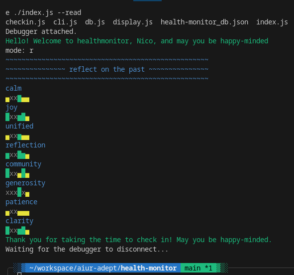

# healthmonitor

quantifying my health variables for insight and monitoring

### usage

Simply run `node index.js --write` (or `-w`) at the end of each day,
and `node index.js --read` (or `-r`) whenever you want to look at the data.
